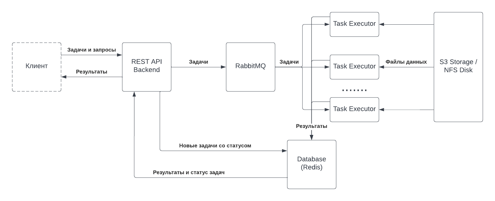

# Формулировка задачи (оригинальный текст)

Написать сервис на Python, который имеет 3 REST ендпоинта:
* получает по HTTP имя CSV-файла (пример файла во вложении) в хранилище и
суммирует каждый 10й столбец
* показывает количество задач на вычисление, которые на текущий момент в работе
* принимает ID задачи из п.1 и отображает результат в JSON-формате
Сервис должен поддерживать обработку нескольких задач от одного клиента
одновременно.
Сервис должен иметь возможность горизонтально масштабироваться и загружать
данные из AWS S3 и/или с локального диска.
Количество строк в csv может достигать 3*10^6.
Подключение к хранилищу может работать нестабильно.

нужно следовать изложенным в задаче условиям. если что-то не указано прямо — можно делать на свой вкус

# Решение

* Клиент отправляет REST API Backend (далее просто Backend) запрос на создание новой задачи обработки.
* В ответ на запрос Backend создаёт запись задачи в Database (Redis), после чего отсылает информацию с путём к файлу в exchange RabbitMQ.
* RabbitMQ настроен так, что отсылает все задачи из приёмного exchange в одну очередь, которую могут читать неограниченное количество Task Executors.
* Каждый Task Executor выбирает для себя задачу из очереди и выполняет её. Он читает файловые данные из S3 Storage или диска, а результат записывает в Database (Redis).
* Backend умеет читать статусы и результаты выполнения задач из Database (Redis) и предоставлять клиентам в виде JSON-ответов.

## Соответствие требованиям

* Backend отвечает за реализацию запрошенного REST API.
* Поскольку задачи хранятся в базе данных, Backend всегда знает, сколько активных задач выполняется.
* После выполнения задачи, Backend может взять результат из базы данных и передать его клиенту в JSON-формате.
* Комбинация из очереди RabbitMQ и базы данных Redis позволяет выполнять множество задач от одного или нескольких клиентов.
* Сервис может масштабироваться горизонтально за счёт увеличения количества Task Executors.
* Backend не будет провисать при выполнении большого количества задач, поскольку нагрузка приходится на Task Executors (конечно, если они c бэком на разных машинах). Тем не менее, он может страдать от большого количества API-запросов.
* За обработку ошибок и поддержание соединения (даже в условиях нестабильности) с S3 Storage отвечает Task Executor.

## Компоненты

* REST API Backend -- web-сервис, написанный на Python (папка `backend/`).
* RabbitMQ -- [надёжный брокер сообщений](https://www.rabbitmq.com/).
* Task Executor -- сценарий обработки, написанный на Python (папка `executor/`).
* S3 Storage -- [внешнее объектное хранилище](https://aws.amazon.com/s3/).
* Database (Redis) -- [база данных Redis](https://redis.io/).

## Спорные решения

* Для реализации REST API используется Flask, так как функциональность по объёму соответствует микросервису, хотя при более нагруженном и широком API лучше было бы взять Django, который к тому же имеет родной ORM.
* На роль базы данных был выбран Redis, так как его легче деплоить в Docker Compose, и он в целом легковесней любого SQL-хранилища. Тем не менее, в реальном приложении стоит использовать персистентную БД с возможностью оптимизации запросов.
* В отличие от других решений, RabbitMQ является явной пушкой для стрельбы по воробьям. Альтернативным решением было бы объединение Backend и Task Executor с последующим размещением их за реверс-прокси Nginx. Тем не менее, RabbitMQ повзоляет показать лёгкость горизонтального масштабирования, которое заключается в том, чтобы увеличить количество Task Executors (например, поменяв одну цифру в Kubernetes или добавив опцию в Compose-файле).

# Руководство по запуску

Для запуска и тестирования решения произведите следующие действия:

1. В файле `docker-compose.yaml` установите значения переменных среды для сервиса AWS S3 (AWS_ID, AWS_SECRET, AWS_URL). Для этого не обязательно использовать сервисы Amazon. Для тестирования я использовал Yandex.Cloud и сервис Object Storage.
2. Запустите команду `docker compose up` (предполагается, что на вашей машине установлен Docker и Docker Compose). Учтите, что по умолчанию Backend пытается занять порт 8000. Убедитесь, что он свободен, или укажите другой порт в Compose-файле.
3. Чтобы направить задание на Backend, отправьте POST-запрос на нужный адрес (см. документ Swagger с описанием API). Например, воспользуйтесь командой `curl -X POST http://localhost:8000/tasks -H 'Content-Type: application/json' -d '{"storage":"s3","bucket":"<BUCKET_NAME>","key":"<OBJECT_KEY>"}'`.
4. Проверьте успешность выполнения задания, используя полученный ID. Например, используйте `curl http://localhost:8000/tasks/<ID_задания>`.
